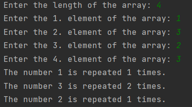

# Frequency of Numbers in an Array

### This program finds and prints the frequency of numbers.

---

## Details
* The program takes the length and elements of the array from the user.
* It finds repeating numbers and their frequency in an array.
* Program output will be as: 

---

## Installation
Clone the project.
> https://github.com/miyendisa/frequency-numbers.git

---

## Usage
After cloning the project, open it with the ide you used.

---

## Requirements
* JDK (version 19 is recommended)

---

## Author
**Aslıhan Hasar**

* GitHub: [miyendisa](https://github.com/miyendisa)
* LinkedIn: [aslıhanhasar](https://www.linkedin.com/in/asl%C4%B1hanhasar
  )
---

## Contributing
Contributions, issues, and feature requests are welcome.

---

## License

[MIT](https://choosealicense.com/licenses/mit/)

---

## Show Your Suport
Give me a &#11088; if you like the project.

---

## Acknowledgments
* This repo is created for my homeworks on www.patika.dev.